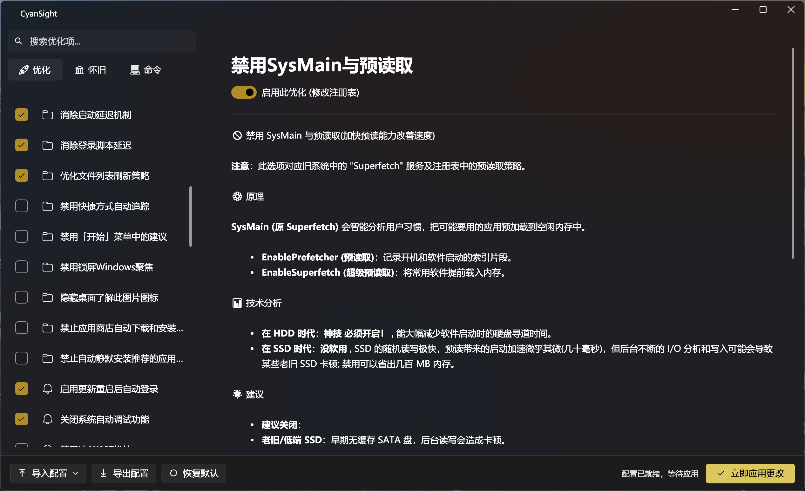

# CyanSight
一款针对现代化的优化软件

何为现代化? 
摒除Windows的向前兼容, 发挥现代硬件的真实实力

本应用设计逻辑也参考了开源项目[ZyperWin++4.1](https://github.com/ZyperWave/ZyperWinOptimize)\
区别在于符合Windows 11 的fluent UI风格, 好看反正
然后也告诉你为什么要优化这项

### 测试设备: 
- Surface Laptop 7 U7-268V 32 + 1T
- Surface Go 2 LTE m3-8100Y 8 + 128

- 最末代和最新代的官方支持Windows 11设备
- 同为移动端CPU
- 同为nvme硬盘
- Surface, Windows阵营的标杆

### 背景
初衷是手上有两台Surface\
Surface孱弱的性能你们知道的, 但是Windows又是个实实在在的💩山\
让本就弱鸡的性能💩上加💩\
总是都是💩💩💩

市面上能找到许多的优化软件,\
但是一般人只会点`一键优化`\
这项优化干了什么, 适不适合当前系统并不知道

看到个`提高前台程序的显示速度`这种一眼牛批的就勾上了\
但是很多只是针对老系统特性的,\
对于最新版本的Windows10/11并不适用,甚至反而是负优化

此应用旨在展示各个常见优化项的具体作用, 适用环境, 以及具体的注册表改动逻辑

并且单独的列出已经过时的怀旧项优化(仅展示,没法操作)

并且可以通过关键词查询\
以此辨别网络上那些杂七杂八的是不是换个名字又来了

不考虑加入根据当前配置自带优化功能
底层的东西还是人为看一眼来的放心

Surface例外(因为我自己有,顺便就做了)

